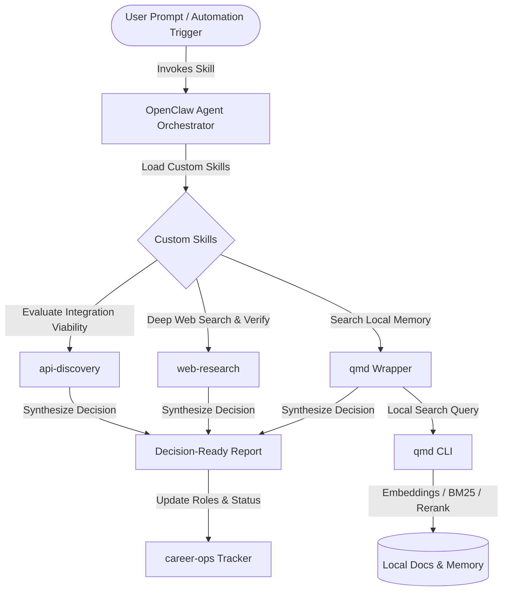

# OpenClaw Jobhunt Automation Portfolio

This repository is a **portfolio workspace** showcasing custom agent skills and workflow integrations built around **OpenClaw** and the open-source **career-ops** project.

## Credits / Upstream Projects

### OpenClaw
[OpenClaw](https://github.com/openclaw/openclaw) is the underlying open-source agent framework used to run skills, workflows, messaging, browser automation, and tool-driven orchestration.

**Important:** I did **not** build OpenClaw itself. This repo is intended to showcase the **custom skills, workflow design, and integrations** I built **on top of** OpenClaw.

### career-ops
[career-ops](https://github.com/santifer/career-ops) is an open-source repo for job search operations, role tracking, and application workflow support.

**Important:** I did **not** build career-ops itself. My work used career-ops as an adjacent/open-source foundation in a broader OpenClaw-powered job-hunt automation workflow.

### qmd
[qmd](https://github.com/tobi/qmd) is a third-party tool that I integrated via an OpenClaw skill wrapper.

**Important:** I did **not** build qmd. The work included here is the **integration layer / skill wrapper** around qmd, not authorship of the underlying tool.

---

## What this repo contains

This repository contains selected OpenClaw skills published from a private workspace into a clean portfolio directory.

### Original workflow designs by me
These represent my own skill/workflow design work:

- `skills/api-discovery/`
  - A workflow for evaluating whether a third-party data source can be integrated reliably.
  - Focus areas include API lifecycle status, authentication model, data coverage, rate limits, tooling, and fallback options.

- `skills/web-research/`
  - A workflow for structured public-web research using links and lightweight extraction.
  - Focused on producing decision-ready summaries with explicit sourcing.

### Integration work by me around an existing third-party tool
- `skills/qmd/`
  - An OpenClaw skill wrapper/integration for the external `qmd` tool.
  - This should be understood as **integration work**, not authorship of qmd itself.

---

## Why this exists

The goal of this repo is to prepare a clean public-facing portfolio example of:
- custom OpenClaw skill authoring,
- workflow/system design for research and integration tasks,
- practical agent-tool orchestration,
- and selected job-hunt automation related extensions built around existing open-source tooling.

This repository showcases the published version of these skills. The contents have been reviewed, sanitized, and made public for display.

---

## Architecture & Data Flow

Below is a system data flow diagram showing how OpenClaw orchestrates these custom skills, uses `qmd` as a local knowledge/memory layer, and integrates with the `career-ops` dashboard format:



---

## Usage & Sample Invocation

In OpenClaw, workspace skills are loaded dynamically by the agent and selected/executed based on the user's natural language prompt (rather than being triggered directly as standalone CLI subcommands).

To run these skills, send a message to the OpenClaw agent:

### 1. Evaluating API Viability (`api-discovery`)
Ask the agent to perform an API viability check on a prospective data source:
```bash
openclaw agent --message "Evaluate whether the GitHub Job Board API is viable for our backend roles integration pipeline."
```

When this prompt is processed, the agent matches the description in `skills/api-discovery/SKILL.md` and uses the skill guidelines to generate a decision-ready assessment.

#### Sanitized Sample Agent Response:
```markdown
# API Discovery Report: GitHub Job Board API

## Decision
**DEFER**: The public API has been sunset. We should use the fallback hybrid web-scraper route.

## Evidence
- **Status**: The v3 Jobs API was sunset in 2021; no replacement API exists.
- **Authentication**: N/A (Endpoint returns 404).
- **Data Coverage**: Search yields empty/error responses.
- **Alternative**: GitHub Jobs are now integrated directly into main platform search feeds, which require web crawling.

## Risks
- Scraper approach is subject to DOM structure changes on github.com/jobs.
- Risk of rate-limiting/IP blocking without proxy rotation.

## Plan
1. Define HTML parser selector mapping for `github.com/jobs`.
2. Integrate `web-research` skill to retrieve search pages.
3. Store results in the `career-ops` local tracking format.

## Fallback
Use LinkedIn/Indeed search feed APIs as primary sources, utilizing GitHub only for direct company site checks.

## Sources
- Official Announcement: https://github.blog/changelog/2021-04-19-deprecation-of-github-jobs/
```

### 2. Searching Local Knowledge Base (`qmd` wrapper)
Ask the agent to query local indexed document collections (resumes, company notes, role tracker databases):
```bash
openclaw agent --message "Search local career documents via qmd for remote role requirements."
```

The agent uses the `qmd` skill wrapper, executing the underlying hybrid query engine (BM25 + vectors + rerank) against the collection and outputting matching lines.

---


## Current contents

```text
skills/
  api-discovery/
    SKILL.md
    references/
      source-checklist.md
      viability-scorecard.md
  qmd/
    SKILL.md
    _meta.json.example
    .clawhub/
      origin.json.example
  web-research/
    SKILL.md
    references/
      source-triage.md
```

---

## Privacy / sanitization notes

This folder is intended to exclude:
- agent memory files
- logs
- private workspace root files
- secrets/tokens
- non-example config files

Sanitized `.example` metadata files are included where relevant instead of real config/registry metadata.

---

## Status

This repository is initialized, committed, and published as a public repository. It showcases the current working version of these custom skills and integrations.
